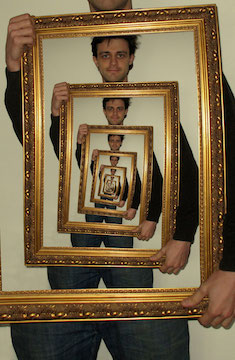

JavaScript Functions
====================

Objective
---------

Students will be able to

* identify and write functions
* predict their behavior, and
* use them to break their programs into smaller sub-programs.

Motivation
----------

> *The best thing about JavaScript is its implementation of functions.*
>
> **Douglas Crockford, JavaScript: The Good Parts**

<!-- -->
> *Generally, the craft of programming is the factoring of a set of
> requirements into a set of functions and data structures.*
>
> **Douglas Crockford, JavaScript: The Good Parts**

<!-- -->
> *Every programming language has one or two things that you really have to  [`grok`](http://en.wikipedia.org/wiki/Grok) in order to understand the rest of the language and its idioms.*
>
> **Alex Notov, WDI Instructor**

In Javascript we must *"grok"* functions.

What is a function?
-------------------

[MDN Function Reference](https://developer.mozilla.org/en-US/docs/Web/JavaScript/Reference/Functions)

A piece of code that we store in order to run it later in our program.
If we have code we'll want to run more than once, possibly from
several different places, we can store it in a function and call it
multiple times.

Syntax
------

This is the basic format of a function.  The body is the code that the
function will run/execute when we call it.

```
function () {
    // body
}
```

By default, a function does not run its body of code, it saves it for
later. To actually get the body to execute, we need to call the
function. In order to call it, we need to give it a name.

```
var sayHello = function () {
    console.log("Hello, World!");
};
```

This creates a function and stores it in a variable named `sayHello`.
However, the code within the function has not been run yet! To do
that, we need to call the function.

```
sayHello();
```

Putting the `()` after the name of the function will cause it to run
the body of code it contains.  In this case, `Hello, World!` will be
printed to the console.

Parameters (Arguments)
----------

Parameters are placeholders that allow you to pass values into a
function.

```
var sayHello = function (friend) {
    console.log("Hello, " + friend + "!");
};
sayHello("Tim");
```

Return Values
-------------

If parameters are things that you give to a function, then the return
value is the thing it gives you back.

```
var sayHello = function (friend) {
    return "Hello, " + friend + "!";
};
var message = sayHello("Tim");
console.log(message);
```

```
var add = function (num1, num2) {
    return num1 + num2;
};
var sum = add(2, 3);
console.log("2 + 3 = " + sum);
```

Exercises
---------
1. Define a function max() that takes two numbers as arguments and
   returns the largest of them. Use the if-then-else construct
   available in Javascript.

2. Define a function maxOfThree() that takes three numbers as
   arguments and returns the largest of them.

3. Write a function findLongestWord() that takes an array of words and
   returns the length of the longest one.


Scope (i.e., Variable Scope)
----------------------------

Which variables can be seen/used from what places in our program.

Variables declared outside of all functions are said to be in the Global Scope.

Variables declared inside of functions are scoped locally to that function.

* [jQuery docs](http://learn.jquery.com/javascript-101/scope/)
* [Smashing Magazine](http://www.smashingmagazine.com/2009/08/01/what-you-need-to-know-about-javascript-scope/)
* [Stack Overflow](http://stackoverflow.com/questions/500431/what-is-the-scope-of-variables-in-javascript)
* [MDN docs](https://developer.mozilla.org/en-US/docs/Web/JavaScript/Reference/Statements/var)

Extras
------

### Methods ###

Methods are functions that are properties of an object.

```
var car = {};
car.make = "Ford";
car.model = "Mustang";
car.start = function () {
    console.log("vroom");
};
car.start();
```

`car.start` is a *function*. It is also a *method* since it is attached to
the `car` object.  Sometimes the words function and method are used
interchangeably, but they do have slightly different meanings.


### Recursion ###



[http://en.wikipedia.org/wiki/Recursion](http://en.wikipedia.org/wiki/Recursion)

A function can call itself. The process of a function calling itself
is called recursion.

Some problems lend themselves to recursive solutions. These are
generally computer science-y questions that interviews love to ask.

#### Famous Recursive Problems ####

1. Factorial
2. Fibonacci sequence
3. Tree/Graph traversal

### IIFE ###

[Immediately Invoked Function Expression](http://gregfranko.com/blog/i-love-my-iife/)

```
(function () {
    // body
})();
```

A function can be created and run (i.e., invoked) in the same step.
This is a pattern you may run across and it can look very odd at
first. However,  realize that it is simply creating a function and
running it all in one step.
